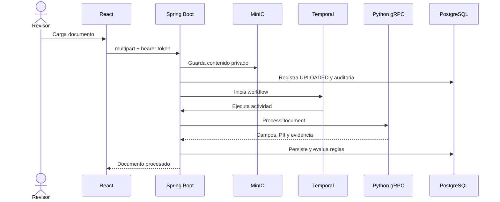

# Arquitectura de ObraClara

## Principios

- El backend Java es propietario del estado empresarial.
- Python no decide aprobaciones; extrae informacion con procedencia.
- Temporal orquesta actividades y reintentos.
- Todo acceso se filtra por organizacion.
- Una afirmacion sin cita exacta se rechaza.

## Flujo de documento

## Frontera de evidencia

La evidencia se genera a partir de una linea existente en una pagina. Java solo publica una cita cuando el texto del campo coincide exactamente con un registro de evidencia del mismo documento y organizacion. Esta validacion impide que una respuesta inventada se presente como respaldada.

## Tenancy

El token demo resuelve `userId`, `organizationId` y rol. Repositorios, archivos, workflows, preguntas, hallazgos y auditoria conservan la organizacion. Los workers Temporal reconstruyen un contexto tecnico limitado para que las mismas comprobaciones se apliquen fuera del hilo HTTP.

## Decisiones

- gRPC evita introducir Kafka junto a Temporal para el mismo trabajo.
- El motor de reglas es determinista para que las metricas sean repetibles.
- MinIO es intercambiable mediante `ObjectStorage` y local es el fallback de pruebas.
- OpenTelemetry exporta trazas OTLP a Jaeger.
- OpenSearch queda bajo un perfil opcional hasta implementar fusion BM25/vectorial.
